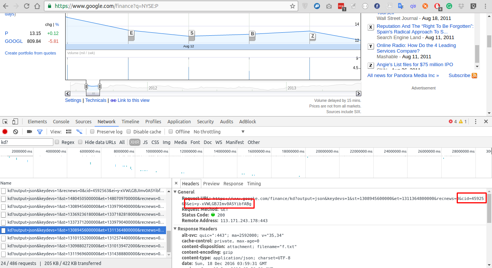

# google-finance-news-crawler
Simple shell bash and js script to crawler news of Google Finance chart. 

# Using 

```sh
git clone https://github.com/duyetdev/google-finance-news-crawler
cd google-finance-news-crawler

# Read section below how to config sh script

# Start 
./crawl.sh

# Start convert output
node ./convert_raw_to_json.js
```

Result:
```json
[
    {
        "title": "Clear Channel takes aim at Pandora with iheartradio revamp",
        "url": "http://www.cleveland.com/music/index.ssf/2011/07/clear_channel_takes_aim_at_pan.html",
        "s": "Plain Dealer",
        "sp": "Bob Pittman, chairman of media and entertainment platforms for Clear Channel Communications Inc., said the success of Pandora Media Inc. proves that people like being able to stream songs according to their personal tastes on mobile devices.",
        "date": "Jul 11, 2011",
        "timestamp": "1310388300"
    },
    {
        "title": "Clever Sense: A Mobile Search Engine That&#39;s Like “Pandora For The Real World”",
        "url": "http://searchengineland.com/clever-sense-a-mobile-search-engine-thats-like-pandora-for-the-real-world-86853",
        "s": "Search Engine Land",
        "sp": "I suspect someone is going to successfully build Google&#39;s “contextual discovery engine” before Google does. The newest company to make a run at what Marissa Mayer was talking about is Clever Sense with its new app “Alfred” (formerly called Seymour).",
        "date": "Jul 21, 2011",
        "timestamp": "1311290001"
    },
    {
        "title": "Dealtalk: Barnes &amp; Noble won&#39;t get better bid than Malone&#39;s",
        "url": "http://www.reuters.com/article/us-dealtalk-barnesandnoble-idUSTRE76B6EN20110712",
        "s": "Reuters",
        "sp": "NEW YORK/PHILADELPHIA Nearly a year after Barnes &amp; Noble Inc (BKS.N) put itself up for sale, the largest U.S. bookstore chain likely will settle for the only firm offer it has received: $1 billion from John Malone&#39;s Liberty Media Corp LINTA.O. Liberty ...",
        "date": "Jul 12, 2011",
        "timestamp": "1310500847"
    }
....
]
```

# Components 

* **[crawl.sh](#crawlsh)** - Bash script, loop in date range and using curl to fetch result, save to `output` folder.
* **[convert_raw_to_json.js](#convert_raw_to_jsonjs)** - Convert output from `output` folder to single json.

### crawl.sh 

```sh
start_date=2011-06-24
d=$start_date
current_date=$(date -I)

# Get new CID and EI from https://www.google.com/finance
cid="4592563"
ei="y-xVWLGBJImv0ASYibfABg"

while [ "$d" != "$current_date" ]; do 
  date_i=$(date -d "$d" +%s) 
  date_i_next=$(date -d "$d + 1 days" +%s) 

  echo "Start >> ${d} >> ${date_i}000"
  curl "https://www.google.com/finance/kd?output=json&keydevs=1&st=${date_i}000&et=${date_i_next}000&recnews=0&cid=${cid}&ei=${ei}" \
  	-H 'Referer: https://www.google.com/finance?q=NYSE:P' \
  	-H 'User-Agent: Mozilla/5.0 (X11; Linux x86_64) AppleWebKit/537.36 (KHTML, like Gecko) Chrome/54.0.2840.59 Safari/537.36' \
  	--compressed | echo "module.exports = $(cat -)" > output/$d.js
  sleep 1
  d=$(date -I -d "$d + 1 days")
done
```

Get `cid` and `ei` token using Devtools



### convert_raw_to_json.js

Nodejs script will convert all output to JSON. Run by

```
node convert_raw_to_json.js
```

# How to contribute

1. Fork the project on Github
2. Create a topic branch for your changes
3. Ensure that you provide documentation and test coverage for your changes (patches won’t be accepted without)
4. Create a pull request on Github (these are also a great place to start a conversation around a patch as early as possible)


# License

MIT License

Copyright (c) 2016 Van-Duyet Le

Permission is hereby granted, free of charge, to any person obtaining a copy of this software and associated documentation files (the "Software"), to deal in the Software without restriction, including without limitation the rights to use, copy, modify, merge, publish, distribute, sublicense, and/or sell copies of the Software, and to permit persons to whom the Software is furnished to do so, subject to the following conditions:

The above copyright notice and this permission notice shall be included in all copies or substantial portions of the Software.

THE SOFTWARE IS PROVIDED "AS IS", WITHOUT WARRANTY OF ANY KIND, EXPRESS OR IMPLIED, INCLUDING BUT NOT LIMITED TO THE WARRANTIES OF MERCHANTABILITY, FITNESS FOR A PARTICULAR PURPOSE AND NONINFRINGEMENT. IN NO EVENT SHALL THE AUTHORS OR COPYRIGHT HOLDERS BE LIABLE FOR ANY CLAIM, DAMAGES OR OTHER LIABILITY, WHETHER IN AN ACTION OF CONTRACT, TORT OR OTHERWISE, ARISING FROM, OUT OF OR IN CONNECTION WITH THE SOFTWARE OR THE USE OR OTHER DEALINGS IN THE SOFTWARE.
